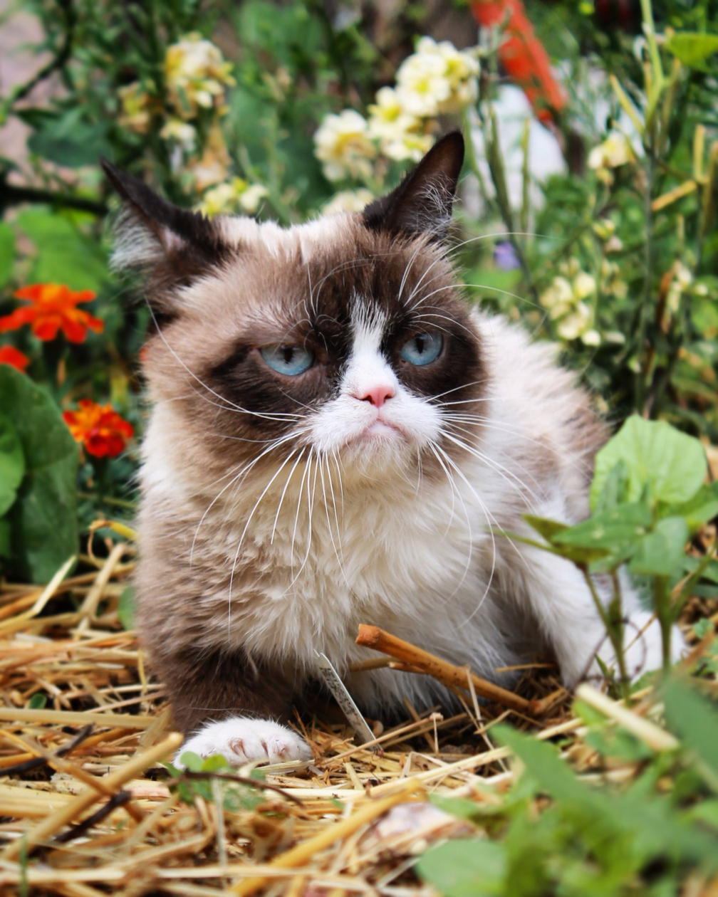

Я пришел в разработку, потому что мне стало интересно программирование. Если быть точным, интересно мне оно стало уже очень давно, еще в колледже, но мне не хватало усидчивости и я не знал где искать информацию структурировано. Не хватало наставника, который бы мог подсказать, что конкретно я делаю не так. Я находил информацию, начинал по ней писать код в трансляторе, получал рабочий код, но после того как вносил код в тренажер, он выдавал ошибку. Задать вопросы было некому и я останавливался. 
Сейчас у меня наконец-то появился шанс изучить программирование и я этим шансом воспользовался.

Для программиста важнее всего:
1. Иметь знание английского языка.
2. Быть внимательным.
3. Уметь работать с программами контроля версий.
4. Уметь писать красивый читабельный код.
5. Уметь работать в команде.
6. Уметь работать с большим объемом информации.

## Добавим фото котика.

Так выгляжу я на работе.

## Создаю конфликт версий файл

Сюда напишу одно.

В ветке Conflict пишу другое. После слияния произойдет конфликт и я оставлю оба варианта текста.

## Удаляем ветки

Ветки удаляются коммандой git branch -d <Имя ветки>.
Я, для примера, удалю ветку Delete. Но перед этим я солью ветку Delete и master.

Ветка Delete удалена.

## Котик был, добавим пёсика

Когда заканчиваешь ДЗ и все получается :)

## Добавление локального репозитория на github

Если ты видишь этот текст, значит все получилось.